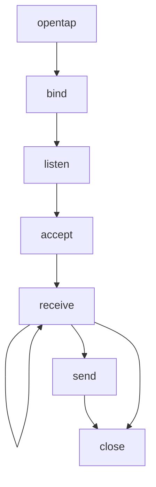
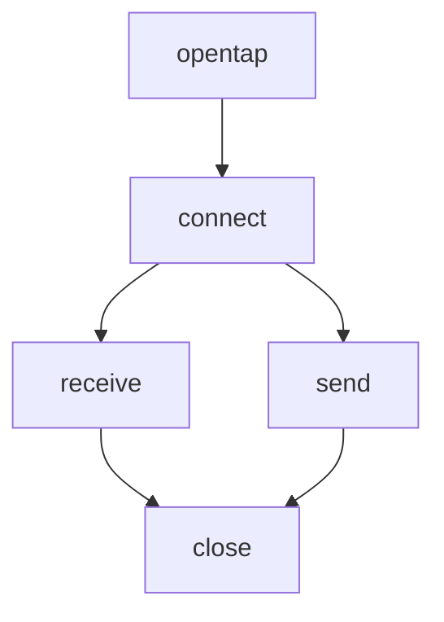

# architecture
here is example of input and output of packets
## send and recv(server)

```mermaid
graph TD;
    opentap-->bind-->listen-->accept;
    accept-->receive;
    receive-->receive;
    receive-->send-->close;
    receive-->close;
```

## send and recv(client)

```mermaid
graph TD;
    opentap-->connect-->send;
    connect-->receive;
    receive-->close;
    send-->close;
```